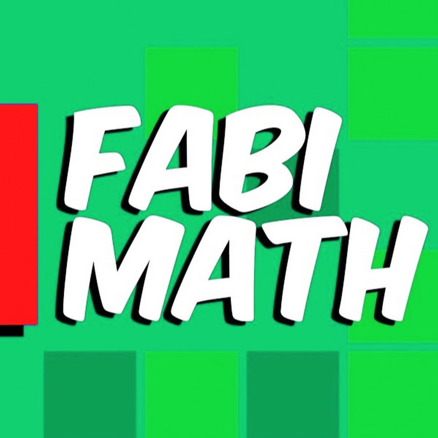

# Fabimath — sitio web oficial

Sitio web oficial de **Fabián Ramírez** — profesor de matemáticas y estadística. Versión naranja, derivada del sitio original en [fabimath.github.io/Fabimath](https://fabimath.github.io/Fabimath/).

## Contenido

| | |
|---|---|
| [Inicio](index.html) | Perfil, material de clases y guías |
| [PAES Estadística y Probabilidad](paes.html) | Curso interactivo del eje: 7 temas con diapositivas, pregunta PAES resuelta, cuestionario y ensayo final de 20 preguntas |
| [PAES Números](paes.html?eje=numeros) | Mismo formato para el eje Números: enteros y racionales, porcentaje, potencias y raíces |
| [Gatos Quiz](quiz.html) | Ejercicios interactivos de estadística |
| [Gatito AES](aes.html) | Calculadora de eximición AES519 |

## Estructura

- `index.html`, `quiz.html`, `aes.html`: páginas estáticas con CSS y JS embebidos, sin build.
- `*_questions.js`: bancos de preguntas de los gatos del quiz.
- `paes.html` + `paes_data.js` + `paes_numeros.js`: página PAES (motor y contenido de cada eje; `paes.html?eje=numeros` abre Números). Los dos ejes comparten puntos, gatos e historial en el mismo `localStorage`. Con el botón «Entrar» el alumno inicia sesión con Google (Firebase, proyecto `fabimath-paes`) y su avance se guarda también en Firestore (`progreso/{uid}`); el correo administrador ve un panel con el avance de todos. En los archivos de datos cada tema tiene `slides`, `example` y `bank`; agregar preguntas es agregar objetos al `bank`. Las fuentes oficiales del DEMRE (temario M1 2027 y las tres últimas pruebas con sus claves) están en `paes/fuentes/`.
- `guias/`: guías en PDF con su fuente `.tex`.
- `fot/`, `logo/`, `*.svg`: imágenes.

La paleta vive en las variables `:root` de cada página (`--royal`, `--azure`, `--sky`, `--ice`); cambiar el tono es editar esos valores.

## Contacto

fabian.ramirez.di@gmail.com · [YouTube](https://youtube.com/c/fabimath/) · [Twitch](https://twitch.tv/fabimath/) · [LinkedIn](https://www.linkedin.com/in/fabi%C3%A1n-ram%C3%ADrez-d%C3%ADaz-955761189/)
